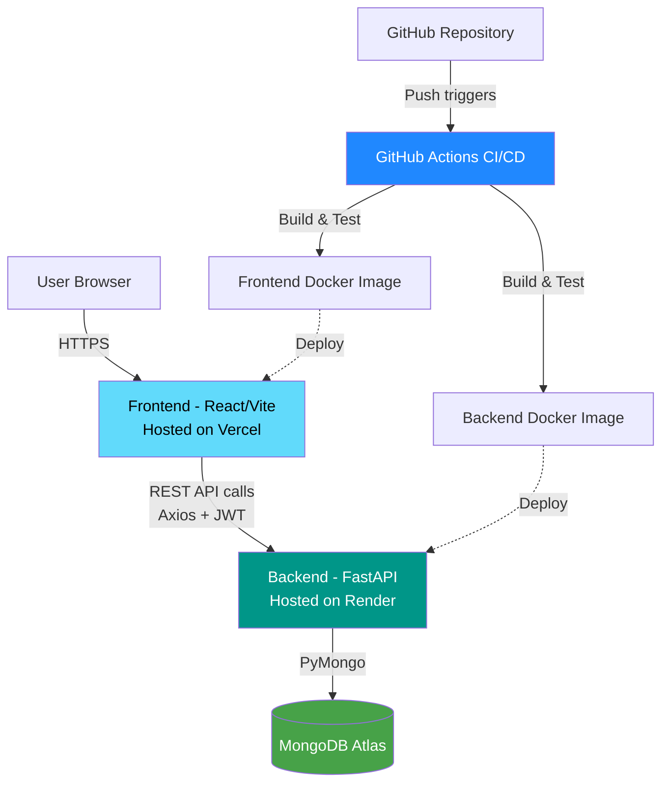

# TaskTrack — Full-Stack Task Management App


## Overview

TaskTrack is a full-stack task management application built as part of a DevOps internship at Devine Innovation. It demonstrates a complete DevOps lifecycle — from development and containerization to CI/CD automation and cloud deployment.

Users can register, log in securely via JWT authentication, and manage their own tasks through a protected dashboard.


## Features

- User registration and secure login (JWT authentication)
- Create, edit, update, and delete tasks
- Mark tasks as Pending or Done
- Filter tasks by status
- Protected dashboard, accessible only after login
- Dockerized with Docker Compose support
- Automated CI pipeline via GitHub Actions
- Deployed on Render (backend) and Vercel (frontend)


## Tech Stack

**Frontend:** React, Vite, Axios, React Router DOM
**Backend:** FastAPI, Python, JWT Authentication
**Database:** MongoDB Atlas
**DevOps:** Docker, Docker Compose, GitHub Actions, Render, Vercel
**Version Control:** Git, GitHub


## Project Structure

```text
tasktrack/
│── backend/
│   ├── app/
│   │   ├── routes/
│   │   ├── auth.py
│   │   ├── database.py
│   │   ├── main.py
│   │   └── models.py
│   ├── requirements.txt
│   └── Dockerfile
│
│── frontend/
│   ├── src/
│   │   ├── api/
│   │   ├── components/
│   │   ├── App.jsx
│   │   └── main.jsx
│   ├── package.json
│   └── Dockerfile
│
│── .github/
│   └── workflows/
│
├── docker-compose.yml
└── README.md
```


## Architecture




## Getting Started

### Prerequisites

Make sure the following software is installed:
- Python 3.11 or later
- Node.js and npm
- Docker Desktop
- Git

### Clone the Repository

```bash
git clone https://github.com/nachammaisundaram/tasktrack.git
cd tasktrack
```


## Environment Variables

Before running the project, create the following `.env` files:

Create a `.env` file inside the `backend` folder:

```text
MONGO_URI=your_mongodb_connection_string
SECRET_KEY=your_secret_key
ALGORITHM=HS256
ACCESS_TOKEN_EXPIRE_MINUTES=30
```

Create a `.env` file inside the `frontend` folder:

```text
VITE_API_URL=http://127.0.0.1:8000
```

### Backend Setup

```bash
cd backend

python -m venv venv

# Windows
.\venv\Scripts\activate

pip install -r requirements.txt

uvicorn app.main:app --reload
```

The backend will be available at:

```text
http://127.0.0.1:8000
```

Swagger documentation:

```text
http://127.0.0.1:8000/docs
```

### Frontend Setup

```bash
cd frontend

npm install

npm run dev
```

The frontend will run at:

```text
http://localhost:5173
```


## Running with Docker

Build and start the application:

```bash
docker compose up --build
```

Stop the containers:

```bash
docker compose down
```


## Live Deployment

### Frontend
https://tasktrack-pied.vercel.app

### Backend
https://tasktrack-backend-aa6n.onrender.com

### API Documentation
https://tasktrack-backend-aa6n.onrender.com/docs


## CI/CD

GitHub Actions is used to automatically build and verify both the frontend and backend whenever changes are pushed to the repository.

The project includes:

- Backend workflow
- Frontend workflow
- Automatic build verification


## Deployment Strategy

Continuous Deployment is handled natively by Render and Vercel — both platforms are connected directly to the `main` branch and automatically redeploy on every push/merge. GitHub Actions handles Continuous Integration (linting, build verification) before code reaches `main`.

## Note on Backups

This project uses MongoDB Atlas's free M0 tier, which does not support automated backups (available only on paid tiers M10+). In a production environment, upgrading to a paid tier would enable continuous backups and point-in-time recovery.


## Key Challenges Solved

- Fixed a bcrypt/passlib version incompatibility causing authentication failures in production
- Resolved MongoDB Atlas network access issues for cloud deployment
- Configured environment-based API URLs for seamless local-to-production transitions

## Future Improvements

Some features I would like to add in the future include:

- Task due dates
- Priority levels
- User profile management
- Search functionality
- Email notifications
- Improved UI and responsive design

## Author

**Nachammai S**

MCA Student (SASTRA University)

GitHub: https://github.com/nachammaisundaram